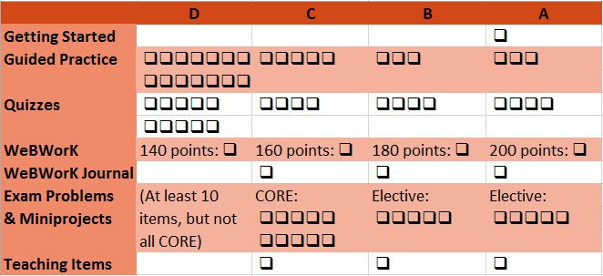

#### Contact Information
__Instructor:__ Serge Ballif  
__Email:__ Please use the Piazza discussion board in the left panel of Canvas.  
__Telephone:__ (702) 992-2613  
__Office Hours:__ NSE 114 Mon/Wed/Fri 8:45-9:20, Tue/Thu 2:30-3:30 Drop by my office any time for help.  

#### Course Learning Outcomes
A successful MTH 201 will demonstrate evidence of mastery of each of the following learning  outcomes:

* Perform basic limit, derivative, and integral symbolic computations correctly and fluently by hand.
* Compute the tangent line to a function at a specific point on its graph.
* Compute the area between the graph of a function and the horizontal axis.
* State the formal definition of the derivative and explain the purpose of the symbols in the definition.
* State the formal definition of the definite integral as a Riemann sum and explain the purpose of the symbols in the definition.
* State and apply the Fundamental Theorem of Calculus. 
* Interpret the meaning of a derivative in terms of the slope of a tangent line and as an instantaneous rate of change in a function.
* Interpret the meaning of a definite integral in terms of total change in a function and in terms of signed area.
* Draw conclusions about the limit, derivative, or integral of a function by examining a function in symbolic, graphical, and numerical/data representations.
* Solve problems that require the use of derivatives to extract useful information and apply it within a larger context, such as in optimization and related rates problems.
* Apply basic knowledge about calculus to new problems.
* Communicate the results of a problem clearly, correctly, and in a manner appropriate to the audience.
* Use a variety of computing technologies effectively to identify patterns, make deductions, visualize information, solve problems and communicate results of one’s work.

#### Course Materials
__Textbook:__ _Active Calculus_ by Matt Boelkins et al. This is a free PDF download at
[http://gvsu.edu/s/xr](http://gvsu.edu/s/xr). If you would like a print copy, see the link at the bottom of that page. We will be working through Sections 1.1--5.3 of this textbook.
__Video materials:__ All course pre-lectures are on a YouTube playlist at [http://bit.ly/GVSUCalculus](http://bit.ly/GVSUCalculus).
__Software:__ The course uses three software tools:

* [Canvas](http://nsc.instructure.com) is the course management system where our course home page is hosted.
* [Desmos](https//desmos.com) , a free program for graphing functions and building models. Guided Practice assignments will be completed using Desmos.
* WeBWorK is our online homework system. WeBWorK can be accessed using the link in the left-hand menu of our Canvas course.

#### Assigned Work
The work you do in the course has two purposes: To help you make sense of the concepts you are supposed to know, and to assess how well you have mastered the learning objectives of the course. These items of work include:

* __Guided Practice:__ These are structured activities that guide you (by questions that you answer) through reading, viewing, and other preparatory activities on new content.
* __WeBWorK Homework:__ For each section there will be about a dozen homework problems to complete using WeBWorK.  These exercises focus on computational skill and basic conceptual  understanding and build upon your first contact with Calculus material you gain
through Guided Practice.
* __WeBWorK Journal:__ Students will record their work on WeBWorK homework problems following the guidelines of the document [WeBWorK Homework Journal Guidelines](images/Math181WeBWorK.pdf)
* __Daily Quizzes:__ At the beginning of each class period where we begin lecture on a new section we will have a quiz to assess how well you have mastered the material of the previous day.
* __Problems:__ The objectives of the course can be broken down into 16 distinct types of problems. Samples of these 16 types are posted to the Blackboard site. Within these 16 types are 6 types that are labeled core , and 10 that are outside the core. These problems are more complex and challenging than those found on Guided Practice, Online Homework, or Concept Quizzes and include elements of each of these. Your ability to solve these problems will be assessed through four Midterm Exams and a Final Exam, described more fully below.
* __Miniprojects:__  In addition to the Problems, eight miniprojects that involve using course technology are available, with 4 of those 8 labelled as core and 4 more outside the core. Miniprojects focus on realworld applications and the use of realworld data and, especially, the use of technology to model and solve problems involving calculus.
* __Teaching Items:__ Finally, to demonstrate mastery of core objectives students will be asked to create three lessons that show that they have mastered the material and are able to communicate it in a thorough and efficient way to an audience of their classmates. Students can complete one project of the types
 - __Texting Lesson__ Students can create a mock question-and-answer session where a teacher teaches the students one of the core lessons of the class.
 - __Video Lesson__ The student will create a screencast video (or some other type of lesson video) summarizing one of the sections of the book.
 - __Desmos Activity__ Students will create a Desmos account at https://teacher.desmos.com and create a lesson activity that illustrates one of the core objectives of the class.

__Grading System__
Math 181 uses a **points-free mastery-based grading system** that is designed to provide you with control over the grading process, transparency as to your progress toward a course grade, and a final course grade that truly reflects your actual mastery of course concepts. Our grading system works as follows:

* At the beginning of the semester, you will be asked to decide on the target grade you plan to earn for the course. This does not need to be an “A”. You’ll be asked to carefully consider your goals, skill set, life situation, academic needs, and so on before stating your target grade. For some students, a “B” or even a “C” is perfectly sufficient and realistic, relative to their situation.
* **The means of assessing your graded work in the class is done without using points**. Instead, your work is graded on a two-level scale of **Pass/No Pass** or on a three level scale of **Mastery/Progressing/Novice**. Whenever you submit work to be graded, I will employ my best professional judgment along with a clear list of specifications for categorizing that work. The specifications for your work are provided in a separate document, and you should make yourself intimately familiar with that document. Your Guided Practice, WeBWorK Homework, WeBWorK Journals, and Daily Quizzes are graded on a Pass/No Pass basis; Problems, Miniprojects, and Teaching Items are graded using Mastery/Progressing/Novice designations.
* The grade you earn at the end of the semester is determined by counting the number of items in each category that you complete at an acceptable level . There are no points involved and no statistical or numerical calculations.

The table for determining your grade is given below. For reference: there are a total of 24 problems and miniprojects, 10 of which are considered core and 14 of which are outside the core. Also, there will be 27 daily quizzes, 27 guided practice assignments, and 220 points of online homework. “Pass” means the following:

* _Guided Practice_: “Pass” means that all questions to be submitted have been submitted before the
deadline, with a goodfaith effort to be right. Correctness of the answers is not factored in.
* _Daily Quiz_: “Pass” means a score of at least 8 out of 10.
* _WeBWorK Journal_: “Pass” means a score of at least 25 out of 30 as outlined in the document [WeBWorK Journal Guidelines](images/Math181WeBWorK.pdf).
All other descriptions of Passing, Mastery, Progressing, or Novice level work are explained in the Specifications for Student Work document, posted separately.

#### To earn an A
* Complete the Getting Started assignment in week 1, AND
* Pass 25 of 27 Guided Practice assignments, AND
* Pass 22 of 27 Daily Quizzes, AND
* Score at least 200 total points on WeBWorK, AND
* Attain Mastery level on all 10 core problems and miniprojects PLUS 10 other problems or miniprojects, AND
* Complete 3 Teaching Items (one of each type) with a Mastery.

#### To earn an B
* Complete the Getting Started assignment in week 1, AND
* Pass 22 of 27 Guided Practice assignments, AND
* Pass 18 of 27 Daily Quizzes, AND
* Score at least 180 total points on WeBWorK, AND
* Attain Mastery level on all 10 core problems and miniprojects PLUS 5 other problems or miniprojects, AND
* Complete 2 Teaching Items (one of each type) with a Mastery.

#### To earn an C
* Complete the Getting Started assignment in week 1, AND
* Pass 19 of 27 Guided Practice assignments, AND
* Pass 14 of 27 Daily Quizzes, AND
* Score at least 160 total points on WeBWorK, AND
* Attain Mastery level on all 10 core problems and miniprojects, AND
* Complete 1 Teaching Items (one of each type) with a Mastery.

#### To earn an D
* Complete the Getting Started assignment in week 1, AND
* Pass 14 of 27 Guided Practice assignments, AND
* Pass 10 of 27 Daily Quizzes, AND
* Score at least 140 total points on WeBWorK, AND
* Attain Mastery level on at least 10 problems and miniprojects (not necessarily all core), AND

